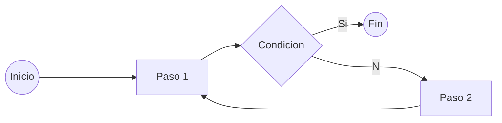

# Enunciado original:

Dado estas 2 Apis:

- https://catfact.ninja/fact - Cat Random Facts
- https://developers.giphy.com/docs/ - Giphy API

Selecciona un dato sobre gatos usando la primera API.

De ese dato, usa **las tres primeras palabras** y busca un gif usando la API de Giphy.

El resultado se tiene que mostrar con una imagen a la izquierda y el texto a la derecha, todo centrado verticalmente.

---

> **Notas extra**:
>
> Originalmente se brindaba la key de la api de Giphy, pero como extra se puede generar una nueva y ademas guardarla en una variable de entorno, para poder subirla a un repositorio sin que sea un dato sensible.
>
> En el video de midu la prueba se realiza utilizando CodeSandbox en lugar de VSCode. Es interesante probar de la misma manera, tanto para conocer CodeSandbox como para codificar sin la ventaja de tener todos nuestros snippets comodos.

---

### Plus:

- Configurar Eslint y Prettier para el codigo.

- Agregar un cartel de loading para dar feedback al usuario hasta que este toda la informacion necesaria.

---

### Consejo:

Antes de empezar a codificar, tomate un momento para pensar como funcionaria tu app. Es mucho mas facil y rapido hacer cambios en papel que en el codigo (Mas sumado al estres de una entrevista en vivo).

Puedes hacer un diagrama rapido y simple como este:

